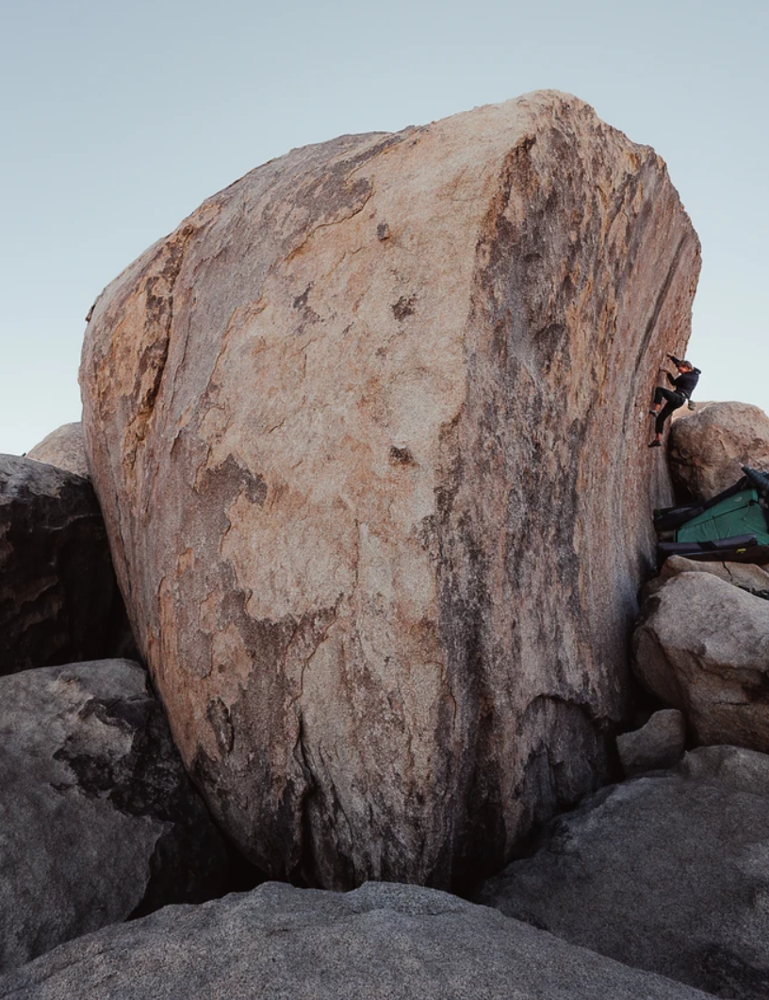
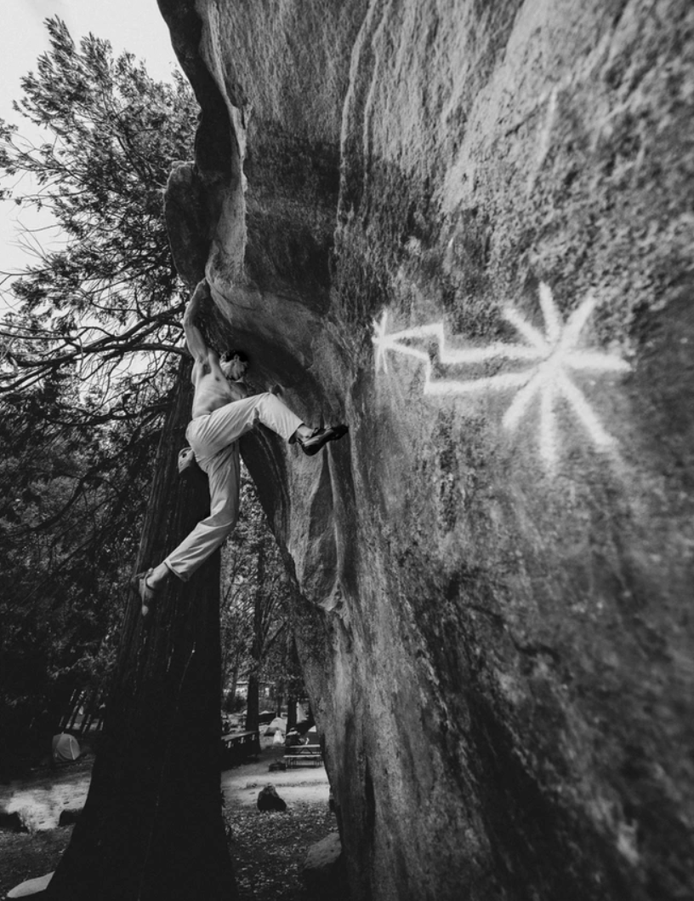

```{r setup, include=FALSE}
knitr::opts_chunk$set(echo = TRUE, message = FALSE,
                      warning = FALSE)
library(tidymodels)
library(tidyverse)
library(ggplot2)
library(corrr)
library(corrplot)
library(naniar)
library(discrim)
library(dplyr)
library(tidyr)
library(knitr)
library(kableExtra)
library(GGally)
library(kernlab)
library(vip)
```
\
&nbsp;
{width="75%"}

## Background

In the sport of rock climbing, the measurement of an individual's skill level has always been somewhat of a contentious topic. Climbing skill can be fundamentally broken into two elements that contribute to performance: technique and strength. Technique is exceptionally hard to quantify, whereas strength can be measured in a multitude of ways. Therefore, it is indicative that strength will be interesting option to perform data analysis on in order to see how it contributes to an individual's climbing ability. In order for us to quantify the connection between ability and strength, we can see how different strength metrics contribute to the differences between certain individual's ability to climb routes graded with specific difficulty. In rock climbing, most routes are given a specific difficulty rating by the first ascentionist, the first person to climb the route, and based solely on their difficulty to complete without falling. Because this system relies heavily on the first ascentionist, it is inherently quite subjective. For this reason, we can focus on one particular difficulty scale that can help eliminate some of the potential bias. For boulder problems, shorter routes that are usually below 20ft tall and climbed sans rope, are graded with the V-scale which ranges sequentially from V0 being the easiest all the way to V17 being the hardest. Because boulder problems are so short, the V-scale is an excellent option for us to base our analysis off of due to their grade representing condensed difficulty rather than longer roped routes which may present other biases from the first ascentionist and other factors. So, if we were to measure climbing skill based off of this V-scale, we can devise a model that helps us take in metrics such as strength and determine their relationship with climbing grade difficulty. Ultimately, the goal of this assessment is to build a model that will allow individuals to predict their climbing difficulty grade based on their physical attributes, while also providing insight as to how improvement in specific areas may contribute to the greatest increase in overall skill. 

  
# Data Information

For the construction of a model, we can use one of the multitude of public climbing surveys on the internet to gather the required data. Specifically, we will use a data sample taken from a 2017 survey across the internet forums of climbing (Reddit, Mountain Project, etc) orchestrated by the user u/higiff on the r/climbharder sub-Reddit. The original post containing the survey link can be found here: [(Visit Survey Page)](https://www.reddit.com/r/climbharder/comments/5qszhe/climbharder_training_survey/). Likewise, the results from the survey are collected in a Google Sheets page that can found here: [(Google Sheets Survey Results)](https://docs.google.com/spreadsheets/d/1J6d45EqIlIsIqNdi2X-Zl-EGFxf9d9T3R_W55xrpEAs/edit#gid=1650492946). 


The survey results are formatted as a dataset that contains 630 total user submissions with 35 variables that we can analyze to formulate our model. In the dataset, there are both variables that are of extreme importance to our model as well as variables that don't strictly contribute to our model building. Most importantly, our data includes three different response variables that we have the option to build our model on. The variables "Hardest V-Grade Ever Climbed", "Hardest V-Grade Climbed in Last 3 Months", and "Hardest V-Grade You Can Send 90% to 100% of the Time" all tell us something different about the individual's climbing ability.


Firstly, the variable showing the hardest v-grade ever climbed tells us the single hardest boulder an individual has done. Initially, this seems like the most appropriate variable to build upon, as it demonstrates exactly what we are looking for in our proposed study question. However, it is important to realize that this variable may not be the best representation of climbing skill as, like stated before, boulders inherently display a bias towards different body sizes depending on the boulder. Likewise, the second variable given may pertain some bias as it is less likely that all individuals have climb boulders that accurately represent their overall climbing ability within the last three months. For these reasons, it would probably be a more accurate representation of overall skill if we model our findings on the third variable, "Hardest V-Grade You Can Send 90% to 100% of the Time" as exemplify an individual's overall skill better than the other variables. Therefore, we will be using this variable as our response variable for our model fit. It is important to note that while the first two variables may not justify the extent of model building, the information that they provide may still be quite informative to some degree, but their inclusion/exclusion in our model should not influence it's accuracy. 


As for predictor variables, the data set in question has a decent number that we can potentially use in order to develop our model. "Frequency of Climbing Sessions Per Week", "Hours Spent Training", "Maximum Pull-ups", and "General Strength Training Frequency" are just some of the variables that are good candidates to perform data analysis on. We will go into what these variables later as we develop our model and each of their significance become prevalent, as for now, information on all the variables can be found in the data set code book. 

\
&nbsp;


{width="60%"}

## Exploratory Data Analysis

```{r load_data, class.source = 'fold-show'}
# Loads the Climb Harder Dataset
data_frame <- read.csv("climbharder.csv")

# Removes Irrelevant Variables
data_frame <- data_frame %>%
  select(-Timestamp, -Hardest.Route.grade.climbed..Ewbank.grade., -Hardest.V.Grade.ever.climbed, -Hardest.V.Grade.climbed.in.the.Last.3.months, -Hardest.route.climbed.last.3.months..ewbank., -Route.grade.you.can.send.90.100..of.climbs, -Other.activities..ie.yoga..cardio.)

```
### Data Tidying
```{r rename}
# Renames Current Variables
climb_harder <- data_frame %>%
  rename(sex = Sex, height = Height..cm., weight = Weight..KG., arm_span = Arm.Span..cm., length_climbing = How.long.have.you.been.climbing.for., location = Where.do.you.climb., ability_grade = The.V.grade.you.can.send.90.100..of.routes, frequency_climbing = Frequency.of.climbing.sessions.per.week, avg_hours_climbing = Average.hours.climbing.per.week..not.including.training., avg_hours_training = Average.hours.Training.for.climbing.per.week, frequency_hangboarding = Hangboard.Frequency.per.week, hangboard_grips = Hangboard.grips.used, hangboard_style = Style.of.Hangboarding.chosen, max_weight_halfcrimp = Max.Weight.hangboard.18mm.edge...Half.crimp..KG....10.seconds...added.weight.only., max_weight_opencrimp = Max.Weight.hangboard.18mm.edge...open.crimp..KG...10.seconds....added.weight.only., min_edge_halfcrimp = Min.Edge.used..mm...kg.if.weight.added.....Half.Crimp..10.seconds., min_edge_opencrimp = Min.Edge.used..mm...kg.if.weight.added....Open.crimp..10.seconds.., frequency_campusboard = Campus.Board.frequency.per.week, avg_hours_campusboarding = Campus.Board.time.per.week..hours., frequency_endurance = Frequency.of.Endurance.training.sesions.per.week, type_endurance = Endurance.training, frequency_strength_training = General.Strength.Training.frequency.per.week, avg_hours_strenght_training = Time.spent.General.strength.training..hours., type_strength_training = Type.of.Strength.training, max_pullup = Max.pull.up.reps, max_weight_pullups = X5.rep.max.weighted.pull.ups, max_pushups = max.push.ups.reps, max_time_Lsit = max.L.sit.time)
```

To begin our data analysis, the first thing we must do is load our data set into R and tidy it. Because we already know that we do not need some variables from our data set, we can go ahead and remove them here alongside our import. The variables that we will not be including are the additional two V-grade variables, the other activities variable, three variables that describe an individual's climbing grades of longer, roped climbs and the "timestamp" variable. These variables will intuitively have no impact on the data analysis we have proposed above, so it is safe to remove them from our data set for clarity sake. Additionally, we can go ahead and rename many of variables from the original data set to ones that will be more convenient to include in future computations. Most importantly, our main response variable is now designated with the name "ability_grade". Like with the original data set, descriptions of each variable can befound within the climbing hard code book. 

First, lets have a look at the first five observations from the data set.
```{r data_view, paged.print=TRUE, results = 'asis'}
climb_harder %>%
  head() %>%
  kbl() %>%
  kable_styling(font_size = 15) %>%
  scroll_box(width = "100%", height = "500px")
```
```{r data_converting_numeric}
# Converts required variables to numeric type.

convert_numeric <- c("max_weight_halfcrimp", "max_weight_opencrimp", "min_edge_halfcrimp", "min_edge_opencrimp", "max_pullup", "max_weight_pullups", "max_pushups", "max_time_Lsit","height","weight","arm_span","frequency_climbing","avg_hours_climbing", "avg_hours_training", "frequency_hangboarding","frequency_campusboard", "avg_hours_campusboarding", "frequency_endurance","frequency_strength_training")

for (i in convert_numeric) {
  climb_harder[[i]] <- climb_harder[[i]] %>%
  suppressWarnings() %>%
  as.numeric()
}

```


The next step involved in tidying our data is to convert variables to their appropriate state. The code chunk above outlines the process of converting the variables that are designated for hangboarding metrics (max_weight_halfcrimp, max_weight_opencrimp, etc) to numeric variables. As this data set is taken from a public survey, many of the response contain values that are not in a similar syntax as the rest of the data. For example, a brief visual analysis of the data set shows that for variables such as max_pushups or max_pullups, many user's included "I don't know" instead of leaving the response blank. We can mitigate this issue by converting many of the variables from character types to be numeric and removing character values/replacing them with numeric. It is important to point out that this is not deleting potential numeric data, just removing inputs that would not be beneficial for our use case. In other words, this should have minimal impact on the total number of missing values that we will discuss briefly. 

```{r data_converting_factors}
# Removes the "I dont boulder" response from the three grade variables
climb_harder <- climb_harder[climb_harder$ability_grade != "I don't boulder",]


# Converts length_climbing, location, and ability_grade to factors.
levels_order_grade <- c("V0", "V1", "V2", "V3", "V4", "V5", "V6", "V7", "V8", "V9", "V10", "V11")
levels_order_length <- c("0 - .5 years",".5 - 1 years", "1 - 1.5 years","1.5 - 2 years", "2 - 2.5 years", "2.5 - 3 years", "3 - 3.5 years", "3.5 - 4 years", "4 - 4.5 years", "4.5 - 5 years", "5 - 5.5 years", "5.5 - 6 years", "6 - 6.5 years", "6.5 - 7 years", "7 - 7.5 years", "7.5 - 8 years", "8 - 8.5 years", "8.5 - 9 years", "9 - 9.5 years", "9.5 - 10 years", "10 - 10.5 years", "10.5 - 11 years", "11 - 11.5 years", "11.5 - 12 years", "12 - 12.5 years", "12.5 - 13 years", "13 - 13.5 years", "13.5 - 14 years", "14 - 14.5 years", "14.5 - 15 years", "More than 15 years")
levels_order_location <- c("Indoor Climbing only","Indoor and outdoor climbing", "Outdoor Climbing only")
levels_order_sex <- c("Male", "Female")
climb_harder$ability_grade <- factor(climb_harder$ability_grade, levels = levels_order_grade)
climb_harder$length_climbing <- factor(climb_harder$length_climbing, levels = levels_order_length)
climb_harder$location <- factor(climb_harder$location, levels = levels_order_location)
climb_harder$sex <- factor(climb_harder$sex, levels = levels_order_sex)
```

```{r ability_grade_frequency, out.width="60%"}
ggplot(climb_harder, aes(x=ability_grade)) + geom_histogram(stat="Count") + labs(title = "Frequency Table of ability_grades", x = "V-Grade", y = "Frequency of V-Grades in Data Set")
```

In addition to converting variables to numeric, a few variables within our data set still need to be factorized in order to be fit our model. In the code above, sex, length_climbing, location, and ability_grade are all converted to factors. Additionally, we can remove any observations that contain the response "I don't boulder" because there would be no point in processing data of individuals who would introduce bias into our models. With this step complete, we can produce a frequency histogram of our response variable ability_grade, or V-Grade sendable 90% to 100% of the time, as shown above. 


```{r equating_binary_variables}
# Adds variable row_id to join new variables
climb_harder <- climb_harder %>%
  mutate(row_id = row_number())

# Adds binary variables for the hangboard_grips variable into a new data frame.
df_separated <- climb_harder %>%
  separate_rows(hangboard_grips, sep = ",\\s*") %>%
  mutate(value = 1)

df_hangboard_grips <- df_separated %>%
  pivot_wider(names_from = hangboard_grips, values_from = value, values_fill = list(value = 0), id_cols = row_id)

# Renames the new variables.

df_hangboard_grips <- df_hangboard_grips %>%
  rename(hangboard_grip.no_hangboard = "I don't Hangboard", hangboard_grip.full_crimp = "Full Crimp", hangboard_grip.half_crimp = "Half Crimp", hangboard_grip.open_crimp = "Open Crimp", hangboard_grip.front3 = "Front 3", hangboard_grip.back3 = "Back 3", hangboard_grip.front2 = "Front 2", hangboard_grip.middle2 = "Middle 2", hangboard_grip.back2 = "Back 2", hangboard_grip.slopers = "Slopers", hangboard_grip.pinch = "Pinch", hangboard_grip.monos = "Monos")

# Adds binary variables for the hangboard_style variable into a new data frame. 
df_separated <- climb_harder %>%
  separate_rows(hangboard_style, sep = ",\\s*") %>%
  mutate(value = 1)

df_hangboard_style <- df_separated %>%
  pivot_wider(names_from = hangboard_style, values_from = value, values_fill = list(value = 0), id_cols = row_id)

# Renames the new variables.

df_hangboard_style <- df_hangboard_style %>%
  rename(hangboard_style.no_hangboard = "I don't hangboard", hangboard_style.min_edge = "Min Edge", hangboard_style.repeaters = "Repeaters", hangboard_style.one_arm = "One arm hang program", hangboard_style.no_hangs = "\"no hangs\"", hangboard_style.other = "Other protocol")

# Adds binary variables for the type_endurance variable into a new data frame. 
climb_harder <- climb_harder %>%
  mutate(type_endurance = ifelse(type_endurance == "" | is.na(type_endurance), "I don't train for endurance", type_endurance))

df_separated <- climb_harder %>%
  separate_rows(type_endurance, sep = ",\\s*") %>%
  mutate(value = 1)

df_type_endurance <- df_separated %>%
  pivot_wider(names_from = type_endurance, values_from = value, values_fill = list(value = 0), id_cols = row_id)

# Renames the new variables.

df_type_endurance <- df_type_endurance %>%
  rename(type_endurance.no_train = "I don't train for endurance", type_endurance.4x4 = "4x4", type_endurance.repeater = "hangboard repeater protocols", type_endurance.max_moves = "Max moves", type_endurance.systems_board = "systems boards", type_endurance.laps = "Laps of routes", type_endurance.arc = "ARC", type_endurance.campus = "Feet on 'campusing'", type_endurance.route_intervals = "route climbing intervals", type_endurance.threshold_intervals = "threshold intervals", type_endurance.other = "other")


# Adds binary variables for the type_endurance variable into a new data frame. 
df_separated <- climb_harder %>%
  separate_rows(type_strength_training, sep = ",\\s*") %>%
  mutate(value = 1)

df_type_strength_training <- df_separated %>%
  pivot_wider(names_from = type_strength_training, values_from = value, values_fill = list(value = 0), id_cols = row_id)

# Renames the new variables.

df_type_strength_training <- df_type_strength_training %>%
  rename(type_strength_training.none = "No other strength training", type_strength_training.antagonists = "Antagonists", type_strength_training.legs = "Legs", type_strength_training.core = "Core", type_strength_training.upperbody_pulling = "Upper body pulling", type_strength_training.upperbodypushing = "Upper body pushing")

# Merges the newly created data frames containing the binary variables for hangboard_grips, hangboard_style, type_endurance, and type_strength training into the climb_harder data frame.

climb_harder_binary <- climb_harder
climb_harder_binary_isolated <- df_hangboard_grips
climb_harder_binary_isolated <- merge(climb_harder_binary_isolated,df_hangboard_style, by="row_id")
climb_harder_binary_isolated <- merge(climb_harder_binary_isolated,df_type_endurance, by="row_id")
climb_harder_binary_isolated <- merge(climb_harder_binary_isolated,df_type_strength_training, by="row_id")

# Now climb_harder_binary can be used as the original dataset + the binary variables, climb_harder is the dataset without the binary variables, and climb_harder_binary_isolated is the data frame containing just the isolate binary variables
climb_harder_binary <- merge(climb_harder_binary,climb_harder_binary_isolated, by = "row_id")
climb_harder_binary <- select(climb_harder_binary, -row_id)
climb_harder_binary_isolated <- select(climb_harder_binary_isolated, -row_id)
climb_harder <- select(climb_harder, -row_id)
```

The last step of data tidying involves splitting one variable into a bunch of new, binary variables for certain predictor variables in our data set. In the case of the survey there are four questions that allow for the submitter to select any of the options listed from the question. For example, when asked what style of hangboard training an individual utilizes, they could select any combination from "max weight", "min edge", "repeaters", "one arm program", "no hangs", "other protocol", or "i don't hangboard". This leaves us with a problem of implementing into our future model because the variable hangboard_style would include values such as "max weight, min edge, repeaters", and there would not be an efficient way to see how the use of either one of these predictors individually effects our model. In order to compensate for this, we can create a new binary variable for each of the answer selections for each variable that represents a question. If a user selects "max weight" and "other protocol", then these new binary variables get assigned the value 1, and they are assigned 0 for the options that are not selected. One caveat from this procedure is the creation of a multitude of new variables for these four questions, but it compensates for this by making fitting a lot simpler and allows us to see how each of these answers can individually effect climbing grade and to what degree. In tidying, there were four total variables that needed to have binary variables created: hangboard_grips, hangboard_style, type_endurance, and type_strength_training, the code for which is outlined in the above chunk. For computation sake, we will treat the climb_harder data frame and the data frame containing these binary variables, climb_harder_binary, as two separate entities for the time being, and only implement them when we need to. 

As a final step of tidying, lets take a look at the first few elements of both the climb_harder and climb_harder binary data frames by using the head() function in R.

```{r data_view2,  paged.print=TRUE, results = 'asis'}
climb_harder %>%
  head() %>%
  kbl() %>%
  kable_styling(font_size = 15) %>%
  scroll_box(width = "100%", height = "250px")

climb_harder_binary %>%
  head() %>%
  kbl() %>%
  kable_styling(font_size = 15) %>%
  scroll_box(width = "100%", height = "250px")

```
### Missing Data

As briefly touched on before, there seems to be a conflict with missing data inside the data set. This makes complete sense as the data comes from a public online survey where users had the option to not answer all the questions in their entirety. Because the data set consists of around 630 observations at the beginning, it is important that we do not carelessly remove data that has missing values as we have a limited number of total observations. For this reason, we will take some time to look into the trends behind the missing data and see if there is anything we can do to either mitigate the missing data's influence or simply not use those variables in our model. The first step is to produce a missing variables graph to determine if any missingness trends exist. It is important to note that we do not have to look at the climb_harder_binary dataset due to the fact that all of the variables introduced in that data set are destined to be either 1 or 0, so we can look at the climb_harder data set to save us some time from looking at extra variables.

```{r missing}
vis_miss(climb_harder)
```

As the graph above shows, a large majority of the values from variables about hang boarding routines and normal exercise routes are missing. There is a chance that the inclusion of these variables in our model fit may introduce dramatic inaccuracies, so we will have to be very selective if we want to include them or not. Other than those variables, there does not seem to be a large amount of data from the rest of the survey that does not have respective values except for a few instances for values of arm_span. 

```{r missing2, out.width = "50%"}
# Creates vector with hangboarding variables that contain missing data.
major_missing<-c("max_weight_halfcrimp", "max_weight_opencrimp", "min_edge_halfcrimp", "min_edge_opencrimp","hangboard_grip.no_hangboard")

# Creates a new temporary data frame that has only the variables from the vector above.
climb_harder_missing_test <- select(climb_harder_binary, major_missing)

# Creates a visual representation of hang boarding missing values versus people who hangboard and those who don't.
gg_miss_fct(x = climb_harder_missing_test, fct = hangboard_grip.no_hangboard) + labs(title = "Missing Data Bar of Hangboarding Variables", x = "If an Individual Hangboards or Not (0 = Hangboards, 1 = Doesn't Hangboard)", y = "Variables")

# Creates a visual representation of hang boarding missing values given that an individual hangboards.
climb_harder_missing_test <- climb_harder_missing_test[climb_harder_missing_test$hangboard_grip.no_hangboard != 1,]
climb_harder_missing_test <- select(climb_harder_missing_test, -hangboard_grip.no_hangboard)
gg_miss_var(climb_harder_missing_test) + labs(title = "Missing Data Counts Given an Individual Hang Boards", x = "Number of Missing Variables")
```

Looking at the first of the two figures above, an obvious trend begins to emerge that shows that there is less missing values for individuals who hang board versus those who do not, which makes intuitive sense. Comparatively, nearly all the people who say they don't hang board have missing data. Where as the other variables range from somewhere under 50% to just around 70% missing data. Looking at the second figure which focus' on only the proportion of data that is missing from people who hang board tells us the number of entries missing from the data set. This tells us that there probably is not enough data within our data set in order to use these variables as predictors for our response. With this in mind, the accuracy of our model will be significantly higher if we do not include the predictor variables with large amounts of missing data.

```{r, out.width = "50%"}
vis_miss(climb_harder[25:28])
```
Lastly, it may be useful to take a closer look at the last few variables from our data set that describe physical, non climbing workouts. The graph above demonstrates that there is indeed a high proportion of missing data, but there it is question whether two variables out of the four, max_pullup and max_pushups, can be included. For now, we will exclude the other two variables while keeping those in because they have a lower missing rate. In the future, we will determine if we need to remove these as well when fitting a model.

In summary, we can remove max_weight_pullups, max_time_Lsit, max_weight_halfcrimp, max_weight_opencrimp, min_edge_halfcrimp, and min_edge_opencrimp and look at our new data frame missing value graph.

```{r remove_missing, echo = FALSE}
remove_var <- c("max_weight_halfcrimp","max_weight_opencrimp","min_edge_halfcrimp","min_edge_opencrimp","max_weight_pullups", "max_time_Lsit")
climb_harder <- select(climb_harder,-remove_var)
climb_harder_binary <- select(climb_harder_binary, -remove_var)
```
```{r final_vis_miss, out.width = "60%"}
vis_miss(climb_harder)
```

# Description of Predictors

Now that the data is tidy'd and missing values has been addressed, we can begin to describe our remaining predictors and how they may impact the response variable. 

* `sex` Is a factor representing an individual's sex, Male or Female
* `height` A numeric variable representing an individual's height measured in cm.
* `weight` A numeric variable representing an individual's weight measured in kg.
* `arm_span` A numeric variable representing the length from finger tip to tip, measured in cm.
* `length_climbing` A factor representing the years an individual has been climbing, in steps of 0.5 years, from 0 to 15.
* `location` A factor depicting where an individual climbs: Indoor, Outdoor, or both.
* `frequency_climbing` The average number of times climbing per week, from zero to seven.
* `avg_hours_climbing` The average number of hours spent climbing in a given week.
* `avg_hours_training` The average number of hours spent training in a given week.
* `frequency_hangboarding` The average number of times hang boarding per week, from zero to seven.
* `hangboard_grips` Different types of hang boarding training techniques used, split into multiple variables in the climb_harder_binary data frame. Options include: Full Crimp, Half Crimp, Open Crimp, Front 3, Back 3, Front 2, Middle 2, Back 2, Slopers, Pinch, Monos, I don't hangboard.
* `hangboard_style` The style of hang board training used, split into multiple variables in the climb_harder_binary data frame. Options include: Max weight, Min Edge, Repeaters, One arm hang program, no hangs, other protocol, and I don't hangboard.
* `frequency_campusboard` The average number of times campus boarding per week, from zero to seven.
* `avg_hours_campusboarding` The average number of hours spent campus boarding in a given week.
* `frequency_endurance` The average number of times spent training endurance per week, from zero to seven.
* `type_endurance` The type of endurance training used, split into multiple variables in the climb_harder_binary data frame. Options include: I dont train endurance, 4x4, hangboard repeater protocols, max moves, systems boards, laps of routes, ARC, feet on campusing, route climbing intervals, threshold intervals, and other.
* `frequency_strenght_training` The average number of times spent training strength per week, from zero to seven. 
* `avg_hours_strength_training` The average number of hours spent strength training in a given week.
* `type_strength_training` The type of strength training technique used, split into multiple variables in the climb_harder_binary data frame. Options include: Antagonists, Legs, Core, Upper body pulling, Upper body pushing, and No other strength training.
* `max_pullup` Maximum reps of pull-ups
* `max_pushups` Maximum reps of push-ups.

## Visual Trend Inspection

The next step in the data analysis process is defining basic trends within the data. To do this, we can formulate a number of graphs that will inform us of trends and correlations within our data. First, lets take a look into how height, weight, and arm span are distributed alongside climbing difficulty grade. This will give us a good idea as to the relative frequency of different climbing grades of those who responded to the survey compared to their basic physical attributes.

```{r boxplot_height, out.width="40%"}
ggplot(climb_harder, aes(x = ability_grade, y = height)) +
  geom_boxplot() +  labs(title = "Height vs Ability Grade", x = "Ability Grade", y = "Height (cm)")
```

The box plot above demonstrates quite an interesting trend within the data set between these two variables. The left side of the graph shows the widest box and nearly the widest whiskers, and the box and whisker sizes shrink as we move from left to right. In essence, this means that in the lower range of climbing grades, the quantile ranges for height are much wider than they are in the higher grade values. Notably, the a plot of the mean of height for each level of ability seems to have a varying slope.

```{r boxplot_weight, out.width="40%"}
ggplot(climb_harder, aes(x = ability_grade, y = weight)) +
  geom_boxplot() +  labs(title = "Weight vs Ability Grade", x = "Ability Grade", y = "Weight (kg)")
```

As before, a similar trend exists alongside the box and whisker plot of ability grade versus weight, where the weight values have more spread in the lower grade ranges and lower spread in the higher grade ranges. 

```{r boxplot_arm_span, out.width="40%"}
ggplot(climb_harder, aes(x = ability_grade, y = arm_span)) +
  geom_boxplot() + labs(title = "Arm Span vs Ability Grade", x = "Ability Grade", y = "Arm Span (cm)")
```

Lastly, the box plot of arm span and ability grade shows a slightly different trend than the other two graphs. While the lower grade ranges does seem to have more spread than the higher ranges, this trend is less noticeable here than in the other two plots. One thing of importance to be noted here, however, is the fact that the mean seem to increase as climbing grade increases. This is exceptional information that we can use to start inputting into training model. It seems that the relationship between mean arm span and climbing ability is a lot stronger than that of weight or height, which seems to be relatively non-existent. In essence, arm_span may be a somewhat decent predictor of climbing grade, which intuitively makes sense as people with longer arm spans are more likely to be able to reach between holds. 

Next, we can look at some of the relationships between climbing ability grade and other factors within the data set to see if any obvious trends are visible.

```{r location_bar, out.width = "40%"}
ggplot(climb_harder, aes(fill=location, x=ability_grade)) + 
    geom_bar()
```

The bar plot above shows us the distribution of the different levels of the location variable. As apparent, the lower grade ranges are represented by mostly indoor climbing, while the level of both indoor and outdoor climbing dominate the data set. This tells us that the variable may not be the most helpful when building our model, but if the predictor level value is indoor only, then they are more likely to be on the lower end of the grade spectrum. 

```{r length_climbing, out.width = "40%"}
ggplot(climb_harder, aes(fill=length_climbing, x=ability_grade)) + 
    geom_bar()
```

On the other hand, the bar plot of variable for time spent climbing and ability grade seems to demonstrate a present relationship in the data. Like intuition suggests, those who have been climbing for longer times across their life are more likely to have a higher ability. Interestingly, It seems that a bulk of the data where the length_climbing value is between 0.5 and 3 years seems to sit between the grades of V1 and V6, whereas the majority of the data for older climbers is between V3 and V10. The trends outlined by this suggest to us that length_climbing may be a decent predictor to fit out model with.

```{r sex, out.width = "40%"}
ggplot(climb_harder, aes(fill=sex, x=ability_grade)) + 
    geom_bar(position="fill")
```

Lastly, the plot of sex versus climbing grade shows that lower females, which represent a drastically lower proportion of the data set, are more likely to climb in the lower ranges than the higher ones. This is most likely due to the fact that less women over all answered the survey, rather than that men are naturally better at climbing. Nevertheless, this variable may still be a helpful predictor when building our model. 

```{r corrplot, out.width = "60%"}
climb_harder %>%
  select(where(is.numeric)) %>%
  cor(use = "pairwise.complete.obs") %>%
  corrplot(method = 'circle', order = "alphabet", tl.cex = 0.5)

```
```{r phys_corr, out.width = "55%"}
climb_harder_test <- select(climb_harder, c("arm_span","height","weight"))
climb_harder_test %>%
  cor(use="pairwise.complete.obs") %>%
  corrplot(method = "number") 
```


Each of the figures above describe some unique trends within the data set that have appeared so far. The first figure above is a general correlation plot of our data set for the numeric predictors. Some of the obviously connected variables do present positive correlations with each other, such as arm-span increasing with height and weight, which is highlighted by the second figure. While many other variables in the main correlation plot show less correlation between one another, there still seems to be an overall slight positive trend that may display some significance for us down the road. Critically, the existence of a positive correlation between a great deal of the variables included in the plot makes intuitive sense as a majority of them involve whether an individual is training. In essence, it makes sense that if an individual spends more time training, they will probably be more likely to spend time training different facets in order to improve. 


```{r corrplot2}
climb_harder_binary_isolated %>%
  cor() %>%
  corrplot( order = "alphabet", tl.cex = 0.5)
```

In addition, the correlation plot outlined above gives us more insight into the trends of factorized variables within the data set. It can be seen that negative relationships exist across the board between variables about hang boarding training and the the response, "I don't hangboard". One remark of interesting note is the cluster of positive correlation in the lower right quantile of the correlation plot. This trend shows a positive relationship between types of workouts, meaning that if an individual strength trains, they are more likely to strength train in different ways than just one. Likewise, the upper left quantile shows positive correlations between types of hang boarding styles as well.


```{r, out.width = "40%"}
ggplot(climb_harder, aes(fill=as.factor(frequency_climbing), x=ability_grade)) +
  geom_bar() +  labs(title = "Frequency of Climbing by Ability Grade")
```

Lastly for our visual inspection, we will look at the graph that with any prior knowledge of the subject, should be the greatest predictor of climb ability. The graph of frequency climbing per week against ability grade shows us that the correlation is not as strong as prior knowledge may dictate. The each level of the factor seems to have a pretty distinct bell curve, but the difference between the means of each level is not as substantial as anticipated. Nevertheless, the mean difference should help add confidence to the recipe for our model.


To summarize, a brief visual inspection of the trends such as these in our data set tell us that there does seem to be some correlation between the predictors in the data set and the outcome variable, ability grade. Ultimately, to be confident in the relationship between these variables and develop a good way to predict what an individual's climbing ability is based on their values for each predictor, we must develop a statistical model.


\
&nbsp;
{width="40%"}


# Model Building 


## Data Split

In order to begin, we must split our data into two different subgroups that we will use to train our model. This step is called the train/test data split which involves taking a large proportion, around between sixty and eight-five percent, to train our model while using the left over data to test the model. Because our data set is on the lower end of acceptable size for our needs, we need to maximize the amount of data that have to train our model. Therefore, we will split the data 80:20 for training and testing respectively, split on the strata variable, ability_grade. It is important to note that the data set selected in the data split is climb_harder_binary due to the fact that it has the categorical variables for hang board types, endurance training types, and etc that are hard coded to binary variables. For the rest of the analysis, we will be using this data set, as it provides us with the optimal balance between model accuracy, computational energy, and simplicity.

```{r data_split, class.source = 'fold-show'}
set.seed(1)

climb_split <- initial_split(climb_harder_binary, prop = 0.80, strata = "ability_grade")

climb_train <- training(climb_split)
climb_test <- testing(climb_split)
```
```{r dimensions}
cat("Dimensions of the training set: ", dim(climb_train))
cat("Dimensions of the testing set: ", dim(climb_test))
```

After the 80:20 data split, the dimension of 489 is dedicated to the training set while 125 is dedicated to the testing set.

## K-Fold Cross Validation

In order to make sure our data is randomly split, we can use a process called K-Fold Cross Validation to ensure that bias' from data splits are not introduced into our model. Once implemented, the K-fold cross validation will help us produce more accurate models that have less bias and less optimistic estimates, overall providing a better expectation of prediction when utilizing unseen data on the model. We can utilize 10 folds in order to perform the cross validation, the code for which is listed below. 


```{r k_fold, class.source = 'fold-show'}
# K-Folds
climb_folds <- vfold_cv(climb_train, v = 10, strata = ability_grade)

```


## Building a Model Recipe

Finally, its time to begin constructing our model recipe. The recipe is at the forefront of the statistical model. It allows for the input of a multitude of different predictor variables, adjustment to how their weights vary in the model, and attempt to produce accurate predictors of the response variable. In our case, we will be be taking the data, climb_train, from the data split and utilizing it as our training data. 

Since categorical variables that were transformed into multiple binary variables are still in our data set, we must remember to remove them from our recipe in order for them to not influence our predictions in an inaccurate way. The variables in question, `hangboard_grips`, `hangboard_style`, `type_endurance`,  and `type_strength_training` will be removed from the data.


The next part of building a recipe involves accounting for the missing data that we discussed earlier. Remember that we left off the "Missing Data" section with the variables max_pullup and max_pushups having a great deal of missing data and the variable arm_span having a few instances of missing data. In order to account for this in our model, we can impute these variables based on their relationships with others. Firstly, we know that arm_span has a strong relationship with height, strong enough that we can even base arm_span's missing values almost entirely upon height. Therefore, in our recipe we can impute arm_span to follow a regression line that will allow us to substitute the value of arm_span with one correlated with similar values of height.  

Second, we must impute values for the max_pullup and max_pushups variables. From prior information about the general population, common belief is that climbers tend to be quite good at pull_ups and have upper body strength, so there is presumably a decent correlation between these predictors and our response. It is for this reason that when dealing with missing data of these predictors, we take extra care to be concise and accurate with their substitution. In order to do this, we will calculate missing values of max_pullup and max_pushups based on a regression line from the variables: sex, height, weight, arm_span, frequency_climbing, avg_hours_climbing, and more. This estimation should fill our data with accurate substitutions for all the missing values for these variables; hence, eliminating the existence of missing values in our training data.

All in all, our model build is almost complete. The last action to be taken is both center and scale all the predictors in the model in order to weight them properly. 

```{r model_recipe, class.source = 'fold-show'}
recipe <- recipe(ability_grade ~ ., data = climb_train) %>%
  step_rm(hangboard_grips, hangboard_style, type_endurance, type_strength_training) %>%
  # Imputing the arm_span variable
  step_impute_linear(arm_span, impute_with = imp_vars(height, weight)) %>%
  
  # Imputing the max_pushups variable with the median of max_pushups in the data
  step_impute_linear(max_pushups, impute_with = imp_vars(sex, height, weight, arm_span, frequency_climbing, avg_hours_strenght_training, avg_hours_climbing, frequency_campusboard, avg_hours_campusboarding, frequency_strength_training, frequency_endurance, avg_hours_strenght_training, hangboard_grip.no_hangboard)) %>%
  
  # Imputing the max_pullup variable, the more applicable of the two
  step_impute_linear(max_pullup, impute_with = imp_vars(sex, height, weight, arm_span, frequency_climbing, avg_hours_strenght_training, avg_hours_climbing, frequency_campusboard, avg_hours_campusboarding, frequency_strength_training, frequency_endurance, avg_hours_strenght_training, hangboard_grip.no_hangboard)) %>%
  step_dummy(sex, length_climbing, location) %>%
  
  # Centering and scaling all predictors
  step_center(all_predictors()) %>%
  step_scale(all_predictors()) 
```

{width="75%"}

# Model Fitting

The first step in in fitting our recipe to models is to simply decide what models we will use to analyze our data. For the instance of a classification model like we have in this case, we have a number of potential models to fit to our training data. For the climb_harder data set, we will fit a statistical model with Latent Dirichlet Allocation, K-nearest Numbers,Random forest, Support Vector Machine, and Pruned Decision Trees. With these models in mind, the application of the use is quite straightforward. For each model, we must define its engine and set the mode to classification because of ability_grade being nonlinear. Once the model is assigned, we can combine both the recipe and the model to a workflow which will allow us to finally fit the data to our training data. From there, we can use various techniques to analyze the inaccuracies of each mode to determine which one fits out training data the best.


## Latent Dirichlet Allocation (LDA) Model

Our first model, Latent Dirichlet Allocation, our LDA model assignment is quite simple. There are no hyper parameters to tune in our model, so the fit is quite straight forward. In order to provide a brief visual assessment of this model, we can look at the prediction vs truth matrix. Essentially, the columns in the matrix represent actual values of ability_grade in the training data whereas the rows represent the values of ability grade that the model predicted. 

```{r lda, class.source = 'fold-show'}
lda_model <- discrim_linear() %>%
  set_mode("classification") %>%
  set_engine("MASS")

lda_workflow <- workflow() %>%
  add_model(lda_model) %>%
  add_recipe(recipe)

lda_final_fit <- fit(lda_workflow, climb_train)

augment(lda_final_fit, new_data = climb_train) %>%
  conf_mat(truth = ability_grade, estimate = .pred_class)
```
A perfect model would show a distinct diagonal line where each predicted ability_grade is the same as the true ability_grade. As the matrix above shows, there is quite a decent amount of variance away from this imaginary diagonal line. Nevertheless, the gathering from this matrix tells us that, if searching for a range of V-grades with plus or minus one grade away from the mean, then this model may be quite accurate for those purposes!


## K-nearest Neighbors Model

The k-nearest neighbors model classifies a new data point by assigning it the most common class label among its k nearest neighbors in the feature space. The KNN model is also different from LDA because it is a model with a hyperparameter K. This k is the number of nearest neighbors to be selected by the model, but unfortunately we don't know this value right off the back. To find it, we can utilize the folds of the training set and tuning of the hyperparameter k in order to find which value of k will return us with the best value of k. For tuning, we assign k with a grid like system that assigns it a range of values for each fold. Essentially, the model trains over the data for each k givien in the hyperparameter across the folds in order to find a value of k that gives us the best overall model accuracy. In essence, this process adds a great deal of computational time to the training process. For this reason, we fit the model to the tuning grid and load it once in a separate R file so it does not have to be re-generated. The model, workflow, and grid establishment are evaluated in the first chunk, while the code for the model fit can be found in the second chunk with evaluation equal to false.

```{r knn,class.source = 'fold-show',eval=TRUE}
knn_model <- nearest_neighbor(neighbors = tune()) %>%
  set_engine("kknn") %>% 
  set_mode("classification")

knn_workflow <- workflow() %>%
  add_model(knn_model) %>%
  add_recipe(recipe)

knn_grid <- grid_regular(neighbors(range = c(1,200)),
                             levels = 8)

```

```{r knn_tune, eval = FALSE, class.source='fold-show'}
knn_fit <- tune_grid(
  knn_workflow,
  resamples = climb_folds, 
  grid = knn_grid
)

saveRDS(knn_fit, "climbharder_knn.rds")
```

Following the tuning fit of the K-nearest neighbors model, R produces an autoplot for accuracy given different values of k, which can be found below.

```{r knn_plot,warning=FALSE}
knn_results <- readRDS("climbharder_knn.rds")
knn_results  %>% autoplot()
```
Lastly, the code chunk below outputs the best value of k, neighbors, and finalizes the fit with that value of k in order to assign our best K-nearest neighbors models.
```{r best_knn}
best_knn <- select_best(knn_results)
best_knn
knn_final <- finalize_workflow(knn_workflow, best_knn)
knn_final_fit <- fit(knn_final, data = climb_train)
```


## Random Forest Model

Our next model is called the random forest model. The random forest model is a decision tree model that produces a random forest and averages the resulting predictions in order to produce an accurate assessment of the data. Like with K-nearest neighbors, the random forest model we are producing requires tuning of hyperparameters. Again, the model, workflow, and grid are created in the following code chunk, but the model is tuned in a separate R file. The hyperparameters of our model are mtry, trees, and min_n which are given a range of 1 to 84, 200 to 600, and 10 to 20 respectively at 6 different levels. This model takes a significant amount of computational energy because of the number of trees assigned and the number of variables in our dataset.


```{r rf, class.source = 'fold-show'}
rf_model <- rand_forest(mtry = tune(),
                        trees = tune(),
                        min_n = tune()) %>%
  set_engine("ranger",importance = "impurity") %>%
  set_mode("classification")

rf_workflow <- workflow() %>%
  add_model(rf_model) %>%
  add_recipe(recipe)

rf_grd <- grid_regular(mtry(range = c(1,84)),
                       trees(range = c(200,600)),
                       min_n(range = c(10,20)),
                       levels = 6)
```

```{r tune, eval = FALSE, class.source= 'fold-show'}
rf_tune <- tune_grid(
  rf_workflow,
  resamples = climb_folds,
  grid = rf_grd
)

saveRDS(rf_results, "climbharder_randomforest.rds")
```


Listed below is the autoplot for the results of the random forest model generation against our training data. The lower axis represents the number of randomly selected predictor variables for each gerenation and the lines within the graph represent the numbers of trees used. In our model, we are looking for the greatest accuracy of prediction.
```{r rf_plot}
random_forest_results <- readRDS("climbharder_randomforest.rds")
autoplot(random_forest_results) + labs(title = "Auto Plot for Random Forest Model")
```

The code chunk below outlines the best hyperparameters for our training set. As outlined, the best accuracy comes from when mtry = 17, trees = 600, and min_n = 18. Additionally, the chunk assigns these hyperparameters to a final model fit in order to perform analysis.

```{r best_rf}
best_rf <- select_best(random_forest_results)
best_rf
rf_final <- finalize_workflow(rf_workflow, best_rf)
rf_final_fit <- fit(rf_final, data = climb_train)
```
Additionally, we can produce the graph below which signifies the predictors with the greatest importance.

```{r, out.width = "50%"}
rf_final_fit %>% extract_fit_parsnip() %>%
  vip()
```


## Support Vector Machines Model

The support vector machines model transforms each value for a given predictor and plots it in an n-dimensional vector space, followed by computing a plane that describes the data in the most appropriate way. Then, the data is transformed into the resulting weighted values. The model construction for this model requires one parameter and one hyper parameter to be tuned. The parameter degree will be set to one, while we will tune the cost parameter. Like before, the tuning grid and model construction are evaluated below, but the tuned grid fitting is evaluated in a separate R file.


```{r support_vector_machines, class.source = 'fold-show', eval=TRUE}
svm_model <- svm_poly(degree = 1, cost = tune()) %>%
  set_mode("classification") %>%
  set_engine("kernlab")

svm_workflow <- workflow() %>% 
  add_recipe(recipe) %>% 
  add_model(svm_model)

svm_linear_grid <- grid_regular(cost(), degree(), levels = 5)
```

```{r svm_tune, eval=FALSE, class.source= 'fold-show'}
svm_linear_res <- tune_grid(svm_workflow, 
                            climb_folds, svm_linear_grid)

saveRDS(svm_linear_res, "climbharder_svm.rds")
```
The autoplot for SVM produced by R shows us a wild jumping scatter of accuracy and roc_auc, but there is a peak roc_auc with a very high value in the first portion of the graph.
```{r svm_read}
climbharder_svm <- readRDS("climbharder_svm.rds")
climbharder_svm  %>% autoplot() + labs(title = "Auto Plot for Support Vector Machines Model")
```
```{r best_svm}
best_svm <- select_best(climbharder_svm)
best_svm
svm_final <- finalize_workflow(svm_workflow, best_svm)
svm_final_fit <- fit(svm_final, data = climb_train)
```


## Pruned Decision Trees

Our last model is another style of decision tree, called a pruned decision tree. This is slightly more simple than the random forest tree, but it may be able to describe some additional trends where the random forest model could not. As is the case with all the other models, work flow and tuning are setup below, but there is only one hyperparameter to tune. In this case, we will tune the cost_complexity hyperparameter which is logarithmic by default with a range from negative five to negative one, with 8 levels. Applying this fit to our training folds, we can sufficiently produce the model and begin comparison.

```{r pruned}
pruned_model <- decision_tree(cost_complexity = tune()) %>%
  set_engine("rpart") %>% 
  set_mode("classification")

pruned_workflow <- workflow() %>% 
  add_model(pruned_model) %>% 
  add_recipe(recipe)

pruned_grid <- grid_regular(cost_complexity(range = c(-5, -1)), levels = 8)
```

```{r pruned_tune, eval = FALSE, class.source= 'fold-show'}
pruned_fit <- tune_grid(
  pruned_workflow, 
  resamples = climb_folds, 
  grid = pruned_grid
)

saveRDS(pruned_fit, "climbharder_pruned.rds")
```

Outlined below is simple autoplot for the model. In picking the data, we are searching for the spot with the highest level of accuracy and ROC_auc. 
```{r pruned_read}
climbharder_pruned <- readRDS("climbharder_pruned.rds")
climbharder_pruned  %>% autoplot() + labs(title = "Auto Plot for Pruned Decision Trees Model")
```
In conjunction, we can output that complexity value that gives us the highest accuracy and ROC_auc, and finalize our model fit with this value.

```{r best_pruned}
best_complexity <- select_best(climbharder_pruned)
best_complexity
pruned_final <- finalize_workflow(pruned_workflow, best_complexity)
pruned_final_fit <- fit(pruned_final, data = climb_train)
```

Additionally, we can produce the graph below which signifies the predictors with the greatest importance.

```{r, out.width = "50%"}
pruned_final_fit %>% extract_fit_parsnip() %>%
  vip()
```


# Model Accuracy Analysis

In order to judge our models precision, we can look at one of two different metric for classification problems. The accuracy percentage of the estimate and the ROC area under the curve. Because we have a multilevel factor as our response, the computation for ROC_auc will be much more complex. Therefore, we can look at the accuracy estimate in order to determine which of our models performed the best in comparison to one another.

To accomplish this, there are 5 augmentations of the training data for each of the models where the accuracy of the prediction is compared to the true value. These 5 augmentations are assigned to a vector and destined to output their estimate value. A list of these values can be found in the table below.

```{r accuracies}
lda_metric <- augment(lda_final_fit, new_data = climb_train) %>%
  accuracy(truth = ability_grade, estimate = .pred_class)

knn_metric <- augment(knn_final_fit, new_data = climb_train) %>%
  accuracy(truth = ability_grade, estimate = .pred_class)

rf_metric <- augment(rf_final_fit, new_data = climb_train) %>%
  accuracy(truth = ability_grade, estimate = .pred_class)

svm_metric <- augment(svm_final_fit, new_data = climb_train) %>%
  accuracy(truth = ability_grade, estimate = .pred_class)

pruned_metric <- augment(pruned_final_fit, new_data = climb_train) %>%
  accuracy(truth = ability_grade, estimate = .pred_class)


finalized_metrics <- c(lda_metric$.estimate, knn_metric$.estimate, rf_metric$.estimate, svm_metric$.estimate, pruned_metric$.estimate)
model_names <- c("LDA",
            "KNN",
            "Random Forest",
            "Support Vector Machine",
            "Pruned Decision Tree")
model_estimates <- tibble(Model = model_names,Accurcy = finalized_metrics) 
model_estimates
```

As the table describes, the model with the highest level of accuracy was the random forest model with our given values of hyperparameters: mtry = 17, trees = 600, and min_n = 18. For this reason, we will be using the random forest model the continuation of our testing data!


# Model Testing

Now its time to switch up the model procedure. Instead of using the training subdivision of our data split, we now will be using the testing data. Firstly, we can do what we have before in order to check the model's accuracy estimate by augmenting the testing data and comparing the true values of ability grade to that of the model's predictions.


```{r test_accuracy, class.source= 'folds-show'}
rf_metric_test <- augment(rf_final_fit, new_data = climb_test, type = "prob") %>%
  accuracy(truth = ability_grade, estimate = .pred_class)
rf_metric_test
```

As the above chunk shows, the estimate value is significantly lower than that of the training data. Overall, this means that the model is not very representative of a high proportion of the data.

```{r auc_vals}
roc_auc_values <- numeric()
# Loop through each class level
for (i in levels(climb_train$ability_grade)) {
  binary_truth <- as.numeric(climb_train$ability_grade == i)
  pred_column <- paste0(".pred_", i)
  auc <- augment(rf_final_fit, new_data = climb_train, type = 'prob') %>%
    roc_auc(binary_truth, pred_column)
  roc_auc_values <- c(roc_auc_values, auc$.estimate)
}
level_names <- c("V0",'V1','V2','V3','V4','V5','V6','V7','V8','V9','V10','V11')
model_roc <- tibble(Leveels = level_names,ROC_auc = roc_auc_values) 
model_roc


```
This is somewhat confirmed by the ROC_auc levels listed above. The average levels with a couple standard deviations (V3-V6) have high levels of area under the curve, while ability grades outside that area have substantially lower prediction levels. We can confirm this by looking at these two plots side by side in the chunk below.

```{r roc_compare}
augment(rf_final_fit, new_data = climb_test, type = 'prob') %>%
  roc_curve(as.numeric(climb_train$ability_grade == "V5"), .pred_V5) %>%
  autoplot()

augment(rf_final_fit, new_data = climb_test, type = 'prob') %>%
  roc_curve(as.numeric(climb_train$ability_grade == "V1"), .pred_V1) %>%
  autoplot()
```

As the graphs show, there is a drastic different between the prediction accuracy of these two variables. Unfortunately, because this model is the best performing model that we have, this is the extent of the accuracy of our model.

### SVM Check

 We can check another model to see if it's results are in any way similar to inaccuracies of the random forest model, so we will look into the Support Vector Machine. The estimate for this model's testing can be found in the following chunk.
 
```{r test_accuracy2, class.source= 'folds-show'}
rf_metric_test <- augment(svm_final_fit, new_data = climb_test, type = "prob") %>%
  accuracy(truth = ability_grade, estimate = .pred_class)
rf_metric_test
```

Once again, the accuracy estimate for this model is quite low, although a bit higher. We can plot all the ROC_auc values again and see where differences lay.

```{r auc_vals2}
roc_auc_values <- numeric()
# Loop through each class level
for (i in levels(climb_train$ability_grade)) {
  binary_truth <- as.numeric(climb_train$ability_grade == i)
  pred_column <- paste0(".pred_", i)
  auc <- augment(svm_final_fit, new_data = climb_train, type = 'prob') %>%
    roc_auc(binary_truth, pred_column)
  roc_auc_values <- c(roc_auc_values, auc$.estimate)
}
model_roc2 <- tibble(Leveels = level_names,ROC_auc = roc_auc_values) 
model_roc2
```
A similar trend seems to exist among the SVM model in comparison to the random forest. However, this model seems to have particularly higher auc values in the regions where the data is more centralized. Critically, this could mean that this model is better suited, despite being not suited in the general case, for our data over the random forest model.

{width="75%"}

# Conclusion

Ultimately, the conclusion that has arisen from our analysis is not of our real desires. Most of the models that were trained on the data set ended up producing models that were not as precise as one could desire. This likely does not come from the model construction themselves, but more likely than not comes from the correlation of the data as a whole. Like stated in the introduction of this statistical report, climbing grades are incredibly hard to associate with an individual, let alone quantify and predict. Critically, the main goal of this analysis was to provide some insight as a whole to what potentially contributes to the grades that people are able to climb. All in all, these models would most likely be used as a tool for climbers to input their metrics of each predictor variable and see what estimated grade returns and focus more so on the range around that prediction. While correlation is not super high between predictors and the response, users can still input arbitrary values in order to gain perspective of which facets of their training regiment they can change in order to see increased climbing ability.

All in all, this statistical analysis does not provide the most accurate model to predict climbing difficulty abilities of individuals. Ultimately, this can simply be used as a tool for those interested to gain some perspective into any potential trends within foundation level aspects of the sport. While their inaccuracies of the Support Vector Machine model is quite low in the bottom end of the V-scale, its important to note that they get increasingly more accurate as the grades increase. Conclusively, the use of these models to predict data should be taken lightly, and moreso used as a tool with limited application.

